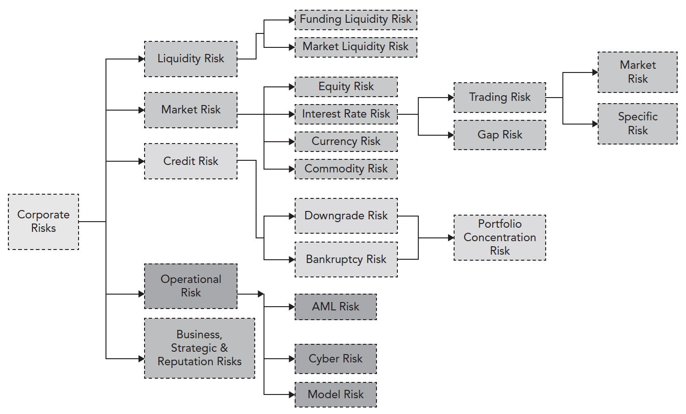

# Foundations of Risk Management
- [Basic Sense of Risk](#Basic-Sense-of-Risk)
- [Basic Risk Types](#Basic-Risk-Types)
- [Risk Management](#Risk-Management)

---

## Basic Sense of Risk

Risk 
: Possibility of the bad things that might happen
: Not always a bad thing, Good risk, Bad risk

Risk management
: Actively select the types and levels of risks

Risk Management Process
: Identify the risk, Analyze and measure risk, Assess the effects & balance between risk and reward, Manage using tools

Analyze and measure risk
: Quantitative Risk Measures: **VaR**(Value at risk), uses the loss distribution associated with a position or portfolio to estimate losses at a given level of likelihood
: Qualitative Risk Measures: **Scenario analysis**, **Stress testing**

Scenario analysis
: Compare a best-case scenario to a worst-case scenario
: Factors the potential impact of several categories of risk, influences decision by **qualitative concept**
: To understand the assumed full magnitude of potential losses even if the probability of the loss is very small

Stress analysis
: A form of scenario analysis that examines a financial outcome based on a given "stress" on the entity
: Adjusts **one** parameter at a time

Expected Loss(EL)
: Average loss expected to incur, estimated by historical data of a period of time
: Credit risk of a loan, EL=Exposure amount at default(EAD) * Loss given default(LGD) * Probability of default(PD)
: EL is often priced into the product directly

Unexpected Loss(UL)
: Surprising loss that above the EL in bad days
: UL = VaR - EL
: **Economic capital/Risk capital** is the amount of **liquid** capital used to cover unexpected loss
: Correlation risk, concentration

Tail Risk
: Extreme variance in losses over long intervals of time,  beyond confidence level which cannot be explained by VaR
: Extreme value theory(EVT), black swans
: Expected shortfall is the EL of tail distribution

Risk adjusted return on capital (RAROC)
: = Reward / Risk
: = after-tax risk-adjusted expected return(EL is subtracted)/economic capital
: Solve conflicts between EL and UL
: Should be higher than the cost of equity capital
: **Business comparison**, allows to compare business lines that require different amounts of economic capital
: **Investment analysis**, determine if return above hurdle rate
: **Pricing strategies**, re-examine pricing strategy for different customer segments and products
: **Risk management cost/benefit analysis**, compare the cost of risk managemen

Three lines of defense
: **business line** that generates, owns, and manages risk (risk owner)
: **risk managers** implement day-to-day oversight
: periodic independent oversight and assurance, such as **internal audit**

---

## Basic Risk Types

Market risk
: **Equity price risk**, volatility of stock prices
: **Interest rate risk**, volatility in interest rate
: **Currency (Foreign exchange) risk**, monetary losses from unhedged foreign currency positions
: **Commodity price risk**, price volatility of commodities, due to the concentration of specific commodities in the hands of relatively few market participants, Input/Output Price Risk, Indirect Exposure
: General market risk (systematic risk), Specific risk (idiosyncratic risk)

Credit risk
: Failure of one party to fulfill its financial obligations to another party
: **Bankruptcy risk/default risk**, **Downgrade risk**, **Counterparty risk**, settlement or Herstatt risk

Liquidity Risk
: **Funding Liquidity Risk**,  ability to raise the necessary cash (debt, cash requirements, margin requirements, collateral requirements, capital withdrawals)
: **Market (Trading) Liquidity Risk**, not able to execute a transaction at the prevailing market price

Operational Risk
: inadequate or failed internal processes, people, and systems or from external events
: **EXCLUDES** business, strategic and reputational risk
: **INCLUDES** Legal risk, Regulatory risk, anti-money laundering risk, cyber risk to risks of terrorist attacks, rogue trading, model risk

Business Risk
: Customer demands, pricing decisions, supplier negotiations, and product innovation management

Strategic Risk
: Involves making critical, long-term decisions

Reputation Risk
: Sudden fall in market standing or brand with economic consequences, a **loss of confidence** in the firm's financial soundness, a **perception of a lack of fair** dealing with stakeholders
: Often one of the outcomes of experiencing a loss in another risk category, such as significant credit risk, operational risks such as a cyberattack
: Social media can amplify reputation risk, quickly widespreads inaccurate info

Risk Aggregation
: One single risk factor could ultimately spill over many kinds of risks
: Different risks have different characteristics

## Risk Management

Risk Management Strategies
: Avoid, Transfer, Mitigate, Keep
: Determine a risk appetite first

Risk Appetite
: Describes the **amount and types** of risk a firm is **willing** to accept
: Contrast to **risk capacity**, 
: The **board** must characterize an appropriate risk appetite
: Connected to a firm’s overall business strategy and capital plan
: Clear communication throughout the firm, risk management consistent with fundamental strategic and risk appetite choices
: Quantitative and qualitative statements
: Subject to external constraints

Five-step risk management process
1. Identify risk **appetite**
2. **Map** known risks
3. **Operationalize** the risk appetite
4. **Implement** a plan
5. **Monitor** and adjust the plan as needed